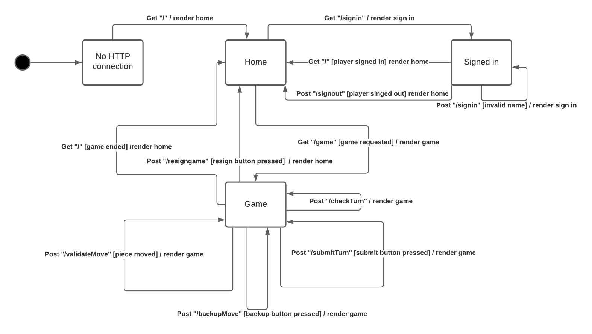

# PROJECT Design Documentation
<!-- comment
> _The following template provides the headings for your Design
> Documentation.  As you edit each section make sure you remove these
> commentary 'block quotes'; the lines that start with a > character
> and appear in the generated PDF in italics._
-->

## Team Information
* Team name: Something-Cool
* Team members:
  * Kevin Hlavaty
  * Corey Urbanke
  * Russell Lee
  * Ray Lorenzo
  * Danny Gardner

## Executive Summary

This project allows players to play local checkers games using any common
web-browser. Players can start playing by signing in using their name, and
then initiate a game by selecting the name of other signed in players.

### Purpose
This project was created in order to allow people to have fun playing
checkers, while also teaching some people how to play checkers.

### Glossary and Acronyms

| Term | Definition |
|------|------------|
| CheckersGame | Represents a game of checkers |
| Player | An object that represents the actions of a real life player|
| Board, BoardView | An object that represents a checkerboard |
| Row | A row of the BoardView object |
| Space | A Object that represents a location on the Row |
| Piece | A checker object that is moved by a Player |
| Move | A class that represents a move for a checker piece.|

## Requirements
<!--
This section describes the features of the application.

> _In this section you do not need to be exhaustive and list every
> story.  Focus on top-level features from the Vision document and
> maybe Epics and critical Stories._
-->

The project should allow a player to be able to start a game of checkers against an opponent. The game will keep track of the progress of a game and award a win condition to the player if either:

* The opponent has no pieces left, OR
* The opponent resigns.

### Definition of MVP

The player is able to sign in, play a game of checkers against an opponent, and then sign out of the web service .

### MVP Features

The MVP features:

* Sign in/out functionality
* Making a move
* "Jumping move" for pieces
* Resigning from a game

### Roadmap of Enhancements

A list of enhancements that will come to the project are :

<!-- * Player Help - Receive a hint or instructions on how to play the game upon pressing a button -->
* Spectator mode - View an ongoing game and be able to watch other people play.
* Replay mode - be able to watch replays of the past games that were played.

## Application Domain

This section describes the application domain.

* A signed-in Player is able to join a match with another signed-in Player who is not already in a game.
* The two players play a WebCheckers game on a Board until one Player wins and the other loses.
* Pieces on the Board can be moved by a Player when it is their turn. There are different types of moves
  a player can make, either to a valid space or in attempt to capture an opponent Piece.
* Pieces are deemed King Pieces when they reach the last Row of the opponent's side.
* Signed-in Players can spectate a match that two other signed-in Players are in.
* Players who have completed a WebCheckers match can request a replay for that given game.

## Architecture and Design

This section describes the application architecture.

### Summary

The following Tiers/Layers com.webcheckers.model shows a high-level view of the webapp's architecture.

As a web application, the user interacts with the system using a
browser.  The client-side of the UI is composed of HTML pages with
some minimal CSS for styling the page.  There is also some JavaScript
that has been provided to the team by the architect.

The server-side tiers include the UI Tier that is composed of UI Controllers and Views.
Controllers are built using the Spark framework and View are built using the FreeMarker framework.  The Application and Model tiers are built using plain-old Java objects (POJOs).

Details of the components within these tiers are supplied below.

### Overview of User Interface

This section describes the web interface flow; this is how the user views and interacts
with the WebCheckers application.

Once a connection is established, the user is brought to the Home page where they can click a sign in button.
To sign in, the user is brought to the Sign In page and, once signed in, brought back to the Home page.
If a user enters aj invalid name, they are brought back to the sign in page until a valid name is entered.
From the Home page, the user can enter a game with another player, bringing them to the Game page. Finally, when
the game ends, the user is brought back to the Home page where they are still signed in, able to enter another
game.

### UI Tier
<!-- comment
> _Provide a summary of the Server-side UI tier of your architecture.
> Describe the types of components in the tier and describe their
> responsibilities.  This should be a narrative description, i.e. it has
> a flow or "story line" that the reader can follow._

> _At appropriate places as part of this narrative provide one or more
> static models (UML class structure or object diagrams) with some
> details such as critical attributes and methods._

> _You must also provide any dynamic models, such as statechart and
> sequence diagrams, as is relevant to a particular aspect of the design
> that you are describing.  For example, in WebCheckers you might create
> a sequence diagram of the `POST /validateMove` HTTP request processing
> or you might show a statechart diagram if the Game component uses a
> state machine to manage the game._

> _If a dynamic com.webcheckers.model, such as a statechart describes a feature that is
> not mostly in this tier and cuts across multiple tiers, you can
> consider placing the narrative description of that feature in a
> separate section for describing significant features. Place this after
> you describe the design of the three tiers.
-->

When the application starts, the application starts up the `WebServer`, connects to `GetHomeRoute`, and renders to the home page. The user can click on a "Sign In" button and `GetSignInRoute` will then take them to the login page where they can enter a username. If the name is invalid or taken, the `PostSignInRoute` will prompt the user to select another name. Otherwise the user will be brought back to the home menu, where they can now select a game.

Upon selecting a game (by clicking on a player in the lobby), the game calls `GetGameRoute` and starts a game with the other player. During the game, the program calls `PostCheckTurnRoute` to see whose turn it is. During a players turn, a player can move a piece, and it will call `PostValidateMoveRoute` in order to see if the move is valid. If so, the player can either submit the move (`PostSubmitTurnRoute`) or revert their move (`PostBackupMoveRoute`). After the move is submitted, the other player gets to take their turn.

The game ends in one of two ways. 
* The game ends normally ( after a side has their pieces taken. )
* A player resigns (calls `PostResignGameRoute`)

In both cases, the player is brought back to the home menu. From there, the player can start another game, or log out (`PostSignOutRoute`).

### Application Tier
<!-- Comment
> _Provide a summary of the Application tier of your architecture. This
> section will follow the same instructions that are given for the UI
> Tier above._
-->

There are three classes in the application: `PlayerLobby`, `GameManager`, and `GameController`.

* `PlayerLobby` manages the all the players currently signed in. It manages name validation and stores the names in a TreeSet.
* `GameManager` finds/creates a game checkers. It also handles player resignation.
* `GameController` creates a new game board with `Piece`s in preset locations 

### Model Tier
<!-- Comment
> _Provide a summary of the Application tier of your architecture. This
> section will follow the same instructions that are given for the UI
> Tier above._
--> 

Upon starting a new game, the Project creates a new `CheckersGame` to two `Player` entities. The `CheckersGame` creates a new board by creating a two dimensional array and filling it with the `Space` Object, then add the `Piece` Object to some of the spaces. 

In between each `Player` turn, `CheckersGame` uses `BoardView` (which uses `Row`) to  render the board to the web. The `Player` can the `Move` the `Piece` to another `Space` on a different `Position` to advance their turn. Pieces can become Kings if they reach the other side of the board, which allows them to move in any direction. If all the opponents pieces are captured, or the opponent resigns, then the player is assigned the winner, and the opponent is assigned the loser. 

### Design Improvements
<!-- Comment
> _Discuss design improvements that you would make if the project were
> to continue. These improvement should be based on your direct
> analysis of where there are problems in the code base which could be
> addressed with design changes, and describe those suggested design
> improvements. After completion of the Code metrics exercise, you
> will also discuss the resulting metric measurements.  Indicate the
> hot spots the metrics identified in your code base, and your
> suggested design improvements to address those hot spots._
-->

A lot of the code is currently running in `CheckersGame`. One improvement to the code would be to split that class up into smaller classes so that it is easier to test and debug.
 
## Testing
<!-- Comment
> _This section will provide information about the testing performed
> and the results of the testing._
-->
### Acceptance Testing
<!-- Comment
> _Report on the number of user stories that have passed all their
> acceptance criteria tests, the number that have some acceptance
> criteria tests failing, and the number of user stories that
> have not had any testing yet. Highlight the issues found during
> acceptance testing and if there are any concerns._
-->
Out of the 78 classes that are tested, all 78 of them pass the acceptance criteria test. 

### Unit Testing and Code Coverage
<!-- Comment
> _Discuss your unit testing strategy. Report on the code coverage
> achieved from unit testing of the code base. Discuss the team's
> coverage targets, why you selected those values, and how well your
> code coverage met your targets. If there are any anomalies, discuss
> those._
-->

The code testing strategy is to run a unit test for each class in the code. In each unit test, several functions were tested to ensure that they work. For example, the class `BoardView` would get `BoardViewTest`, and in `BoardViewTest`, a test was set on the iterator to make sure it did not return a Null value. These values were selected so that the program does not return an incorrect value, and most of the targets were met. The exceptions were the WebServer and a few lines in CheckersGame.